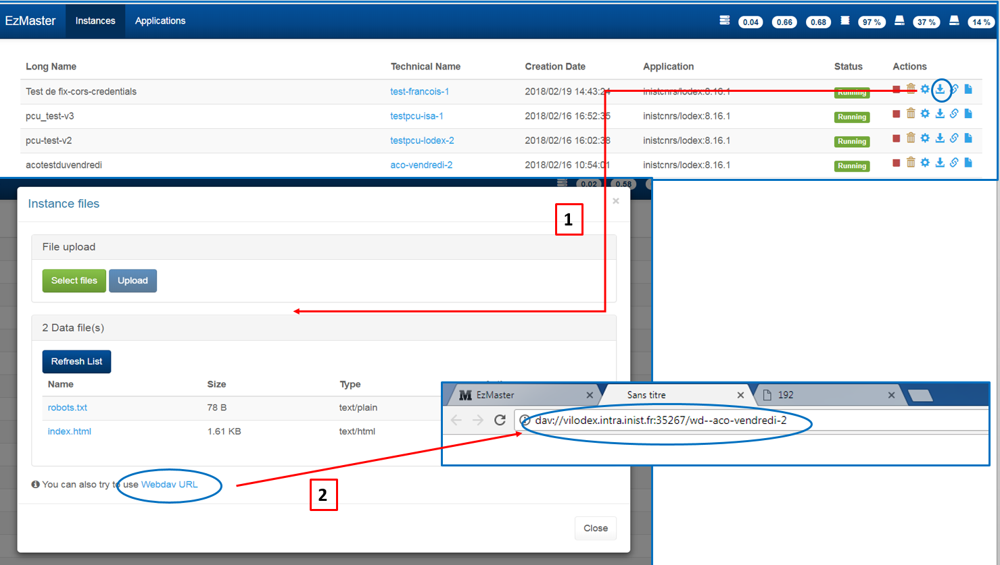
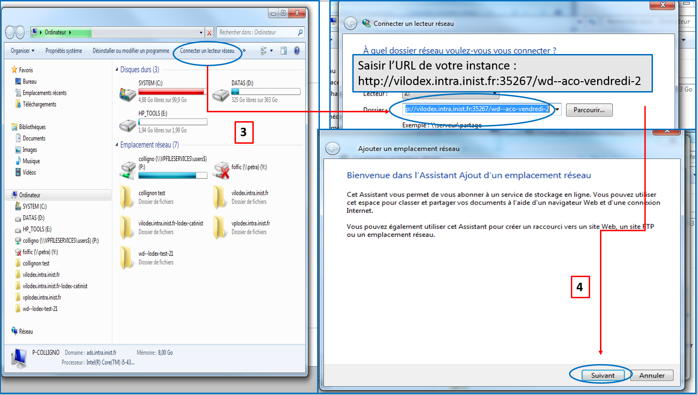
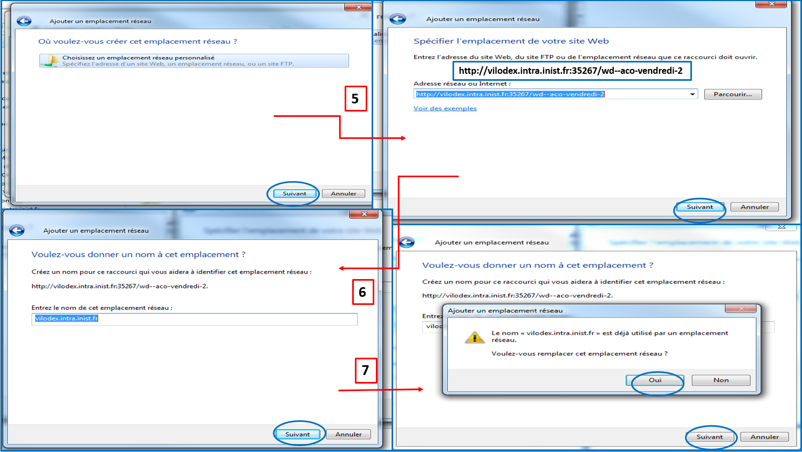
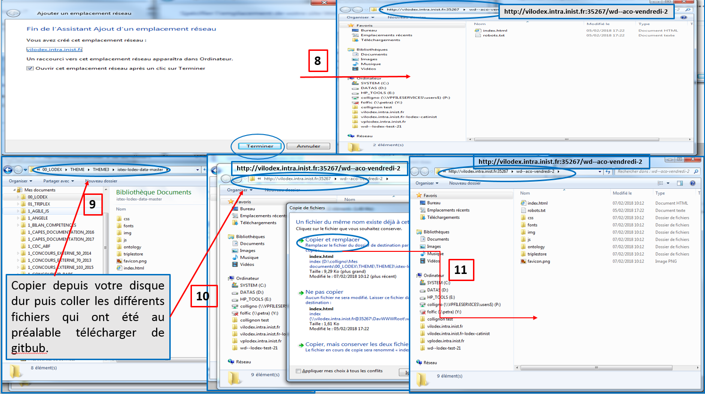
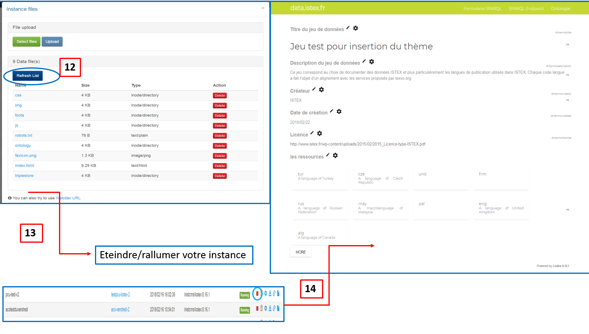

# Personnalisation du thème

Votre jeu de données est publié sur le web. Maintenant il vous reste à l'encapsuler dans votre site personnalisé. Pour cela, vous pouvez aller à l'adresse suivante  [https://github.com/Inist-CNRS/lodex-themes](https://github.com/Inist-CNRS/lodex-themes) pour accéder à une bibliothèque de thèmes prédéfinis.

Chaque thème comporte au moins un fichier `index.html` contenant une balise dont l'identifiant est `root`. C'est dans cet élément HTML que s'instanciera l'application.

Le contenu minimum du fichier `index.html` est donc: `

`.

C'est de la responsabilité du concepteur du thème d'ajouter les différents liens:

* administration: `/admin`
* connexion: `/login`
* liste des ressources: `/graph`

Pour faire prendre un thème en compte par LODEX, il faut mettre les fichiers correspondant dans le répertoire `src/app/custom` du programme, puis le relancer.

Cette opération est plus ou moins simple suivant le contexte.

Si vous avez adopté ezmaster pour installer l'outil, vous devrez utiliser le protocole Webdav pour téléverser les différents fichiers de paramétrage. Ci-dessous, vous trouverez les différentes étapes concernant le paramétrage sous windows :

> **Remarque** : si vous avez adopté ezmaster pour installer l'outil, vous devrez utiliser le protocole Webdav pour téléverser les différents fichiers de paramétrage. TODO: expliquer sous Linux,

