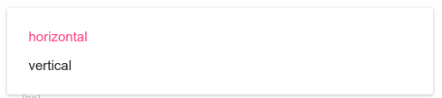
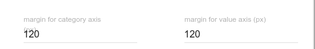

# Bar Chart

Histogramme : 

Diagramme à barres : 

## Paramétrage

Le format `Graphique - Diagramme en barres` \(_Graph - Bar Chart_\) propose de nombreux paramètres.

Les paramètres `Maximum fields number` \(_Nombre max de champs_\), `min value` \(_valeur minimum_\) et `max value` \(valeur max\) permettent de définir, pour le champ représenté, les éléments à afficher.

Seuls sont affichés les éléments dont le nombre d'apparitions est :

* supérieur à la valeur définie dans le paramètre `min value`
* inférieur à la valeur définie dans le paramètre `max value`

### Maximum fields number

Détermine le nombre maximum d'éléments à afficher \(par défaut 5\).

### Min value

Définit le nombre minimum d'apparitions d'un élément dans le corpus pour qu'il soit affiché.

### Max value

Définit le nombre maximum d'apparitions d'un élément dans le corpus pour qu'il soit affiché.

### Order by

L'ordre de tri peut prendre quatre valeurs:

1. libellé ascendant
2. libellé descendant
3. valeur croissante \(par défaut\)
4. valeur décroissante

### Colors set

Ce paramètre permet de choisir la ou les couleur\(s\) du graphique.

La palette des couleurs se décrit par une liste de valeurs RGB hexadécimales séparées par un espace. Pour trouver facilement une palette lisible et plaisante, on peut utiliser l'outil [ColorBrewer](http://colorbrewer2.org).

### Direction

Ce paramètre permet de définir l'orientation du graphique :

1. horizontale \(par défaut\) :  plus indiquée quand on a beaucoup de libellés \(on l'appelle aussi diagramme à barres\)
2. verticale \(pour faire des histogrammes\)

### Marge pour l'axe des catégories \(px\) \(_margin for category axis \(px\)_\) et marge pour l'axe des valeurs \(px\) \(_margin for value axis \(px\)_\)

Ces paramètres permettent de définir les marges des axes horizontaux et verticaux des graphiques \(axes des abscisses et des ordonnées\). L'unité est le pixel \(px\).

### Afficher l'axe des catégories en diagonale \(_display category axis in diagonal_\), afficher l'axe des valeurs en diagonale \(display value axis in diagonal\)

Ces 2 paramètres permettent d'incliner les libellés des éléments du champ représenté et les valeurs associées à ces éléments \(utile quand les libellés sont longs\).

### Arrondir les valeurs sur l'axe \(_force rounded-up value in axis_\)

Quand cette case est cochée \(cochée par défaut\), les échelles des axes sont en nombres entiers.

Ce choix a été fait car, en [IST](https://fr.wikipedia.org/wiki/Information_scientifique_et_technique), les valeurs sont souvent des nombres de documents, donc des nombres entiers.

Si d'autres valeurs \(par exemple pourcentage, taux de citation, _etc_.\) sont représentées, il peut être intéressant d'avoir une échelle en nombres décimaux.

### échelle \(_scale_\)

Ce paramètre permet de changer l'échelle d'affichage des valeurs :

* par défaut, échelle linéaire \(_linear_\) pour l'échelle linéaire, deux graduations dont la _différence_ vaut 10 sont à distance constante
* échelle logarithmique lorsqu'un phénomène utilisant une gamme étendue de valeurs est étudié, l'échelle linéaire est mal adaptée. Une échelle logarithmique qui espace les valeurs faibles et rapproche les valeurs fortes est préférable. Pour l'échelle logarithmique, deux graduations dont le _rapport_ vaut 10 sont à distance constante.

### largeur des barres \(_bars' width_\)

Ce paramètre permet de définir la largeur des barres.

### Routine

Ce format nécessite l’utilisation de la routine [distinct-by](../../../../configuration/routines/distinctby.md), appliquée à l’identifiant du champ représenté, qui doit être déclarée dans `valeur` \(_value_\) selon :

/api/run/distinct-by/**identifiant**/

où **identifiant** est le code attribué par LODEX au champ représenté.

