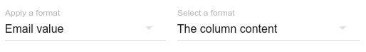
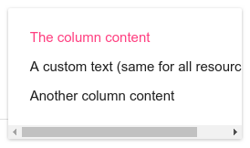

# Email

Le format courriel \(_email_\) rend le mail affiché cliquable.

On peut aussi changer le libellé du lien, avec le second paramètre.

Ainsi, le libellé du lien peut être :

* le contenu du champ \(donc le courriel lui-même, par défaut\)
* un texte identique dans toutes les ressources
* le contenu d'une autre colonne \(par exemple, le nom de la personne\)

