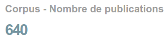

# Emphased Number

Le format _Emphased Number_ sert à mettre en avant un nombre, en changeant sa taille et sa couleur.

## Size

La taille du nombre est à choisir parmi quatre:

1. Très grande
2. Grande
3. Gras
4. Normal

## Colors set

Seule la première couleur de la palette est utilisée, il est donc inutile d'en mettre plus.

