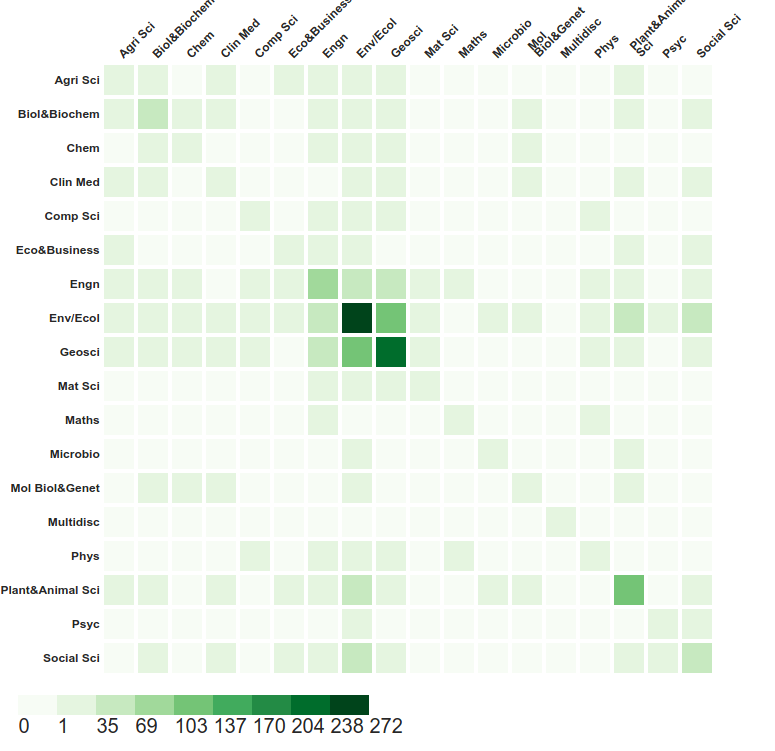

# Heat Map

Le format _Heat map_ présente une carte de chaleur, dont les paramètres sont :

* la palette de couleurs
* l'inversion des axes

## Jeu de couleurs \(colour set\)

Permet de choisir la ou les couleurs du graphique.

## Inverser les axes \(flip axes\)

Permet de visualiser les éléments préalablement affichés à l'horizontale à la verticale, et inversement.

Il est équivalent à l'inversion des identifiants dans la routine indiquée dans `valeur`. Pour l'exemple dans la copie d'écran, il est équivalent à la `valeur`:

/api/run/pairing-with/Gazl/Bzu3/

## Routines

Ce format nécessite l'utilisation de la routine [pairing-with](../../../configuration/routines/pairingwith.md), appliquée aux identifiants du ou des champs représentés, qui doit être déclarée dans `valeur` \(_value_\) selon :

/api/run/pairing-with/**identifiant1**/**identifiant2**/

où **identifiant1** et **identifiant2** sont les codes attribués par LODEX aux champs représentés.

Si la matrice est symétrique \(un seul champ représenté\), la routine a déclarer dans `valeur` \(_value_\) est :

/api/run/pairing-with/**identifiant1**/**identifiant1**/

où **identifiant1** est le code attribué par LODEX au champ représenté.

Si la matrice est asymétrique \(2 champs représentés\), la routine à déclarer dans valeur \(value\) est :

/api/run/pairing-with/identifiant1/identifiant2/

où **identifiant1** et **identifiant2** sont les codes attribués par LODEX aux champs représentés.

