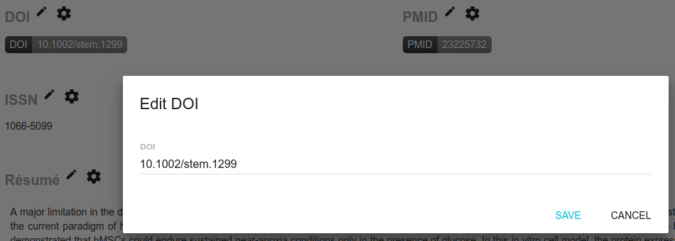

# Identifier Badge

Ce format permet d'afficher un identifiant pérenne \(soit un DOI, soit un PMID\), et d'y ajouter un lien vers la ressource.

Les paramètres sont :

* le résolveur de lien
* les couleurs

