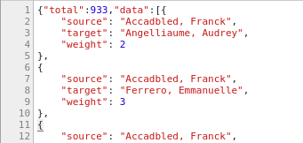

# Network

Le format Network représente la valeur du champ sous forme de réseau \([graphe](https://fr.wikipedia.org/wiki/Théorie_des_graphes) non orienté au sens mathématique\).

La largeur des liens est calculée automatiquement en fonction du poids de ces liens.

La taille d'un nœud est fonction de son degré, c'est-à-dire du nombre de liens le reliant à d'autres nœuds.

On peut cliquer sur un nœud pour griser tous les nœuds qui ne lui sont pas liés \(et leurs liens\).

La position des nœuds est calculée automatiquement, et est dynamique \(cela peut mettre un peu de temps pour se stabiliser\).

## Paramétrage

### Couleur des nœuds \(_Node color_\)

Ce paramètre permet de choisir la couleur des nœuds du réseau à partir du nom de la couleur ou sa valeur RGB héxadécimale. Pour trouver facilement des couleurs lisibles et plaisantes, il existe l'outil[ColorBrewer](http://colorbrewer2.org/) \([http://colorbrewer2.org/](http://colorbrewer2.org/)\).

### Routines

La valeur à fournir à ce format est moins triviale que pour les formats textuels. Comme il faut obtenir les données dans le bon format, on passe par le mécanisme des [routines]().

En l'occurrence, on utilise la routine `graph-by`, associée à l'identifiant du champ à représenter. Les routines sont appelables via l'API de LODEX, en préfixant le nom de la routine par `/api/run/`.

Le nom du champ se trouve dans l'administration, en cliquant sur `Model` / `View Model`.

LODEX liste alors les champs du modèle \(ceux du niveau Dataset, et ceux qui s'appliquent à chaque Document\), avec une colonne `Identifier` qui permet de trouver l'identifiant du champ à utiliser.  
  
En l'occurrence, on trouve `kMul`.

> **Conseil** : il peut être utile, si le contenu du champ doit aussi être affiché dans les ressources, de créer un deuxième champ dédié au réseau, afin de pouvoir spécifier qu'il ne s'affiche ni dans la page listant les ressources ni dans la page des ressources. Ce champ aura la même valeur que celui affiché.

La routine `/api/run/graph-by/kMul/` renvoie un JSON de cette forme :

Si le réseau est _unimodal_ \(un seul champ représenté\), ce format nécessite l'utilisation de la routine [graph-by](../../../configuration/routines/graphby.md), appliquée à l'identifiant du champ représenté, qui doit être déclarée dans `valeur` \(_value_\) selon :

/api/run/graph-by/**identifiant**/

où **identifiant** est le code attribué par LODEX au champ représenté.

Si le réseau est _multimodal_ \(plusieurs champs représentés\), ce format nécessite l'utilisation de la routine [pairing-with](../../../configuration/routines/pairingwith.md), appliquée aux identifiants des champs représentés, qui doit être déclarée dans `valeur` \(_value_\) selon :

/api/run/pairing-with/**identifiant1**/**identifiant2**/

où **identifiant1** et **identifiant2** sont les codes attribués par LODEX aux champs représentés.

