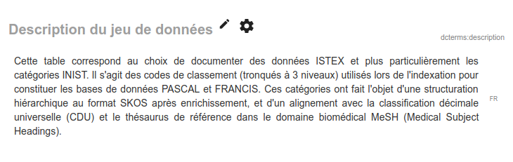
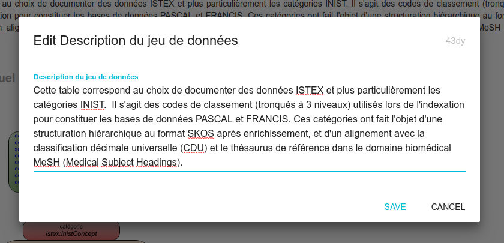

# Paragraph

Le format Paragraph affiche un texte sur plusieurs lignes. Son originalité est d'être éditable d'une manière plus pratique que le format par défaut, qui met tout le texte sur une seule ligne.

