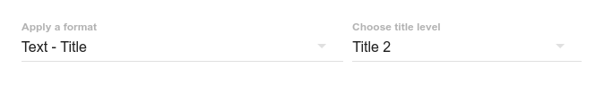

# Title

Le format _Title_ permet d'afficher la valeur d'un champ comme un titre \(visuellement\).

## Paramètre

Le seul paramètre du format _Title_ est le niveau du titre, qui correspond à la balise HTML qui va encapsuler la valeur du champ.

Ainsi, un Title de niveau 2 donnera une balise `<h2>`.

