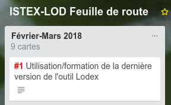
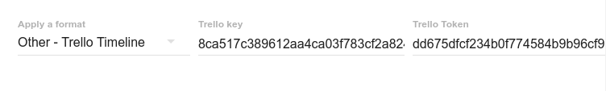

# Trello Timeline

Le format Trello Timeline permet, à partir d'un tableau [Trello](https://www.trello.com), d'afficher une timeline.

 Le tableau correspondant:

## Paramètres

Pour obtenir une clé et un token Trello, voir la documentation [ad hoc](https://trello.readme.io/v1.0/reference#api-key-tokens).

