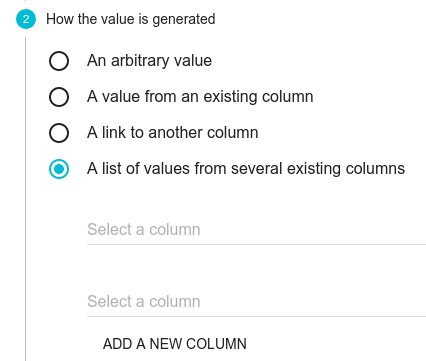

# CONCAT

Concatène les valeurs de deux colonnes du fichier tabulé de départ \(dans un tableau\).

> **Remarque** : ce _transformer_ est caché, il est disponible dans le menu :
>
> 

## Exemple

Fichier CSV :

| a | b |
| :--- | :--- |
| prem | ière |
| deux | ième |

Paramètres de CONCAT: `a` et `b`

Résultats :

1. `[ "prem", "ière" ]`
2. `[ "deux", "ième" ]`

