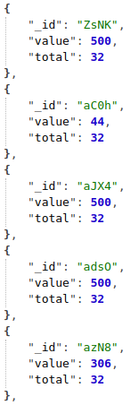

# count-by-fields

La routine `count-by-fields` compte le nombre de documents du corpus pour chacun des identifiants des champs déclarés dans le modèle.

**Exemple** : [http://lodex-cop21.dpi.inist.fr/api/run/count-by-fields/](http://lodex-cop21.dpi.inist.fr/api/run/count-by-fields/)

