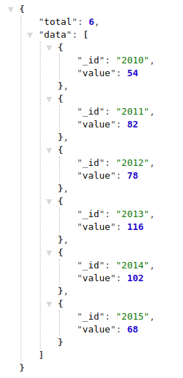

# distinct-by

La routine `distinct-by` compte, pour chaque élément du champ représenté \(identifiant\), le nombre de fois où cet élément apparaît qui correspond à :

* nombre d'occurrences si le champ n'est pas dédoublonné
* nombre de documents si le champ est dédoublonné

Cette routine peut être utilisée avec les formats graphiques :

* [Bubble Chart](../../administration/modele/format/bubblechart.md) \(Graphe à bulles\)
* [Bar Chart](../../administration/modele/format/distribution-charts/barchart.md) \(Diagramme à barres et histogramme\)
* [Pie Chart](../../administration/modele/format/distribution-charts/piechart.md) \(Camembert\)
* [Radar Chart](../../administration/modele/format/distribution-charts/radarchart.md) \(Diagramme Radar\)
* [Cartography](../../administration/modele/format/cartography.md) \(Cartographie\) \(si code ISO 3 ou code ISO 2 des pays\)

Elle doit alors être déclarée dans `Value` \(Valeur\) selon :

/api/run/distinct-by/**identifiant**/

où

**identifiant** est le code attribué par LODEX au champ représenté.

**Exemple** : [http://lodex-cop21.dpi.inist.fr/api/run/distinct-by/Yq6u/](http://lodex-cop21.dpi.inist.fr/api/run/distinct-by/Yq6u/) où `Yq6u` = `Year`

