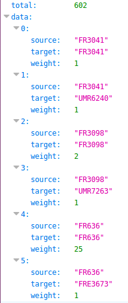

# pairing-with

La routine `pairing-with` \(fournie sur [https://github.com/Inist-CNRS/lodex-extented/](https://github.com/Inist-CNRS/lodex-extented/)\) crée les paires \(`source` et `target`\) entre les éléments de 2 champs \(champs identiques ou différents\) déclarés selon :

/api/run/pairing-with/**identifiant1**/**identifiant1**/

/api/run/pairing-with/**identifiant1**/**identifiant2**/

et compte, pour chaque paire, le nombre de co-occurrences.

Elle peut, en particulier, être utilisée avec les formats [Network](../../administration/modele/format/network.md) \(Réseau\) et [Heat Map](../../administration/modele/format/heatmap.md) \(carte de chaleur\).

> **Attention :** dans le cas où cette routine s'applique à un seul champ \(/api/run/pairing-with/identifiant1/identifiant1/\), elle conserve les _auto-paires_ \(source et cible identiques\). Cela peut être intéressant avec le format [Heat Map](../../administration/modele/format/heatmap.md) pour visualiser la diagonale, mais peut être gênant avec d'autres formats.

**Exemples** :

1. [http://lodex-cop21.dpi.inist.fr/api/run/pairing-with/Xmzn/Xmzn/](http://lodex-cop21.dpi.inist.fr/api/run/pairing-with/Xmzn/Xmzn/)

   

2. [http://lodex-cop21.dpi.inist.fr/api/run/pairing-with/Xmzn/WXcA/](http://lodex-cop21.dpi.inist.fr/api/run/pairing-with/Xmzn/WXcA/)

   

