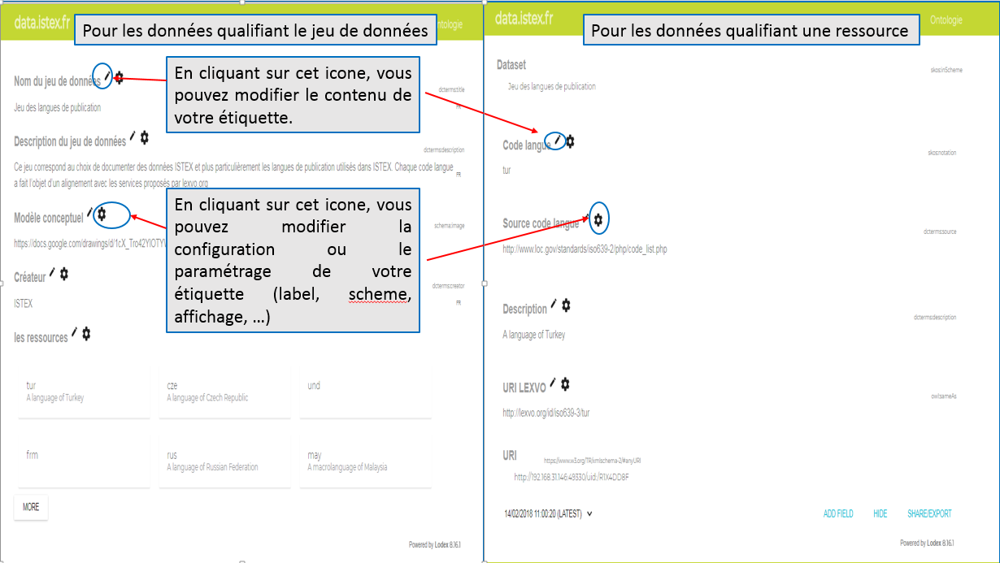
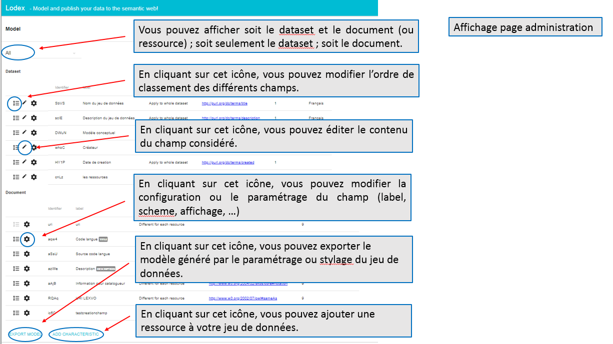

# Vous êtes administrateur

Si vous être _**administrateur**_ de votre jeu de données, vous avez la possibilité de mettre à jour vos données après publication.

Pour cela, cliquez sur le bouton en bas à droite, vous permettant d'accéder au back-office, puis [authentifiez vous](../administration/login.md).

**Quatre** possibilités vous sont offertes, pour mettre à jour votre jeu de données :

1. si vous cliquez sur le bouton `GO TO MY PUBLISHED DATA` de la page d'administration, deux outils sont à votre disposition pour soit **modifier le contenu de votre champ**, soit **modifier la configuration ou paramétrage** de votre champ : 
2. lorsque que vous êtes sur l'affichage "GRAPH LIST", vous avez la possibilité **d'ajouter une nouvelle ressource** à votre jeu de données, selon le modèle ou la configuration établi\(e\) lors de l'[étape de paramétrage - stylage](../processuspublication/parametagestylagedescolonnes.md), en cliquant sur le bouton `ADD A NEW RESSOURCE TO THE DATASET` : 
3. lorsque vous êtes sur l'affichage complet d'une ressource, vous avez la possibilité soit de **créer** un nouveau champ, soit de **supprimer à l'affichage** \(masquer\) la ressource considérée : 
4. lorsque vous cliquez sur le bouton `VIEW MODEL` de la page d'administration, vous arrivez sur la page ci-dessous. Sur celle-ci, différentes actions vous sont proposées : 

