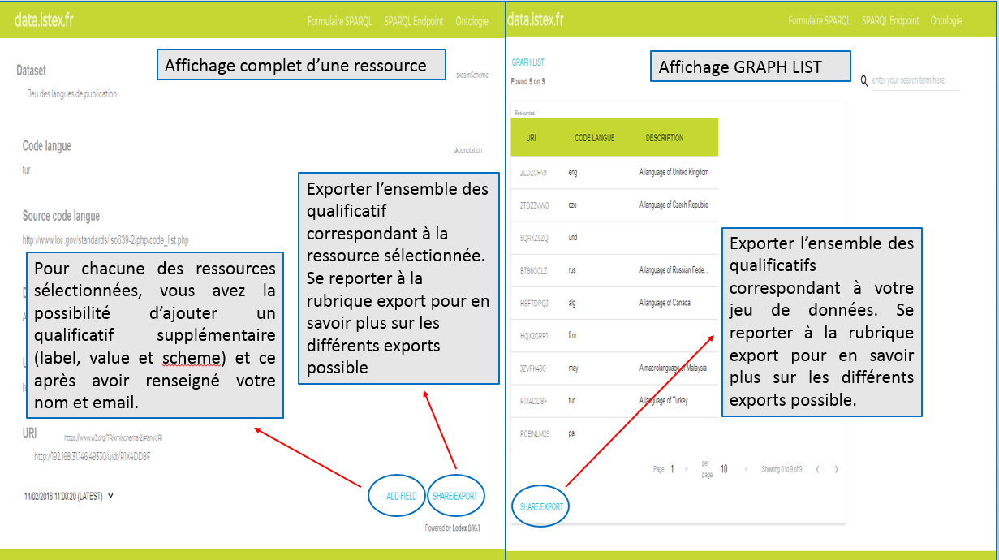

# Vous êtes internaute

Si vous êtes internaute, au niveau de l'affichage complet d'une ressource, vous avez la possibilité de proposer l'ajout de qualificatifs à une ressource et d'exporter les données de cette ressource.

Tandis que pour l'affichage GRAPH LIST, vous avez la possibilité d'exporter l'ensemble des données de votre jeu de données : 

Si vous cliquez sur `ADD FIELD`, le système vous propose ce formulaire de saisie :

Après validation par l'administrateur : 

