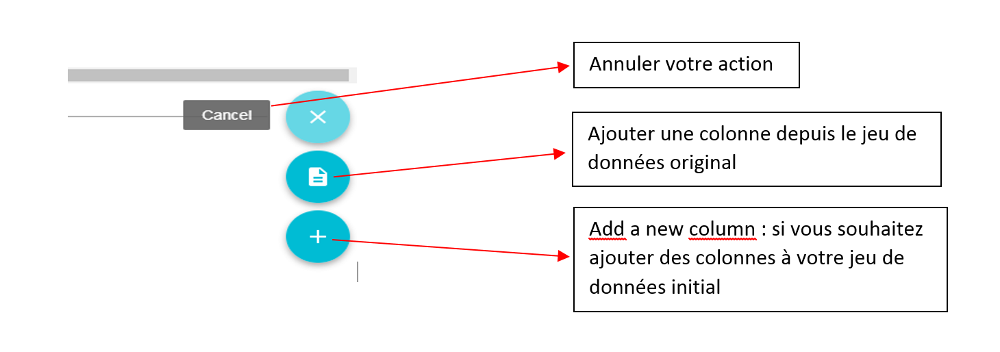

# Chargement du jeu de données

Après vous être authentifié, le système propose cet écran : 

Cliquer sur le bouton "Commencez en chargeant un corpus de données".

L'écran suivant s'affiche.

Deux actions sont à effectuer, dans un ordre indifférent :

* “Choix du parser à appliquer” ; il s'agit du loader permettant de convertir le format du fichier source choisi vers le format Lodex
* "Choix du fichier à charger" : le fichier source contenant les données, extraites de Istex ou d'une autre  source, présent sur le poste utilisateur ou sur le web.

## 1 - Choix du loader

Cliquer sur le texte correspondant. La liste des loaders disponibles s'affiche. 

 Choisir le loader qui correspond à votre format source :

  
- tableau CSV avec précision sur le séparateur : point-virgule, tabulation, tabulation et guillemets, virgule, automatique,  
- fichier au format json, soit dans un tableau, soit extrait de ISTEX, soit déjà compatible avec LODEX \(export de LODEX\),  
- fichier XML utilisant le vocabulaire TEI ou MODS, ATOM, RSS ou SKOS,  
- fichier zip extrait avec l'outil [dl](https://dl.istex.fr/)  : "résultat brut de dl.istex.fr" importe un certain nombre de champs avec intitulés anglais ; "résultats de dl.istex.fr" importe des champs plus nombreux avec intitulés français \(\(liste indicative en annexe\).

## 2 - Choix du fichier à charger

Pour cette étape, vous allez récupérez votre fichier, de format conforme au loader choisi, soit sur votre disque dur, soit à partir d'un site distant. Dans ce dernier cas, il vous est demandé de préciser l'URL du site distant sur lequel votre fichier est hébergé.

Le système vous propose cet écran : 

 Cliquez sur le bouton  `IMPORTER UN FICHIER ou  IMPORTER DEPUIS UNE URL`

Si votre fichier se trouve sur votre disque dur, cliquez sur le bouton `IMPORTER UN FICHIER`. 

Le système ouvre l'explorateur de fichiers de l'ordinateur ; naviguer pour sélectionner le fichier à charger, puis cliquez sur le bouton `Ouvrir`.

 **Remarque** : Le fichier à charger ne doit contenir que des caractères conformes à UTF8 ; la colonne A et la ligne 1 ne doivent pas être vides ; les entêtes de colonnes ne doivent pas comporter de caractères spéciaux \(par exemple les caractères de ponctuation\).

Quand le fichier est importé, le système vous propose cet écran \(extrait\) :

Que lire sur cet écran ?

l'affichage en haut à droite "ERREUR" est normal à ce stade. Il disparaitra après l'étape suivante,  [création de l'URI](creationuri.md).

Les trois actions permises à l'aide du **bouton** `+` **:**   Après cette lecture, l'étape suivante est la [création de l'URI](creationuri.md).

